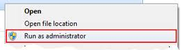

**COMPILATION AND INSTALLATION OF UTILITIES**

_For support of systems with more than _**_64_**_ logical cores you need to compile all binaries below in “_**_x64_**_” platform mode (not the default “_**_Win32_**_” mode)._

## Command-line utility

1. Follow [Compile the windows MSR driver](#compile-the-windows-msr-driver) to compile the windows MSR driver (msr.sys). For Windows 7 and later versions you have to sign the msr.sys driver additionally ([http://msdn.microsoft.com/en-us/library/ms537361(VS.85).aspx](http://msdn.microsoft.com/en-us/library/ms537361(VS.85).aspx)). To enable loading test signed drivers on the system: in administrator cmd console run `bcdedit /set testsigning on` and reboot.

2. Build the *pcm.exe* utility:
   ```
   cmake -B build
   cmake --build build --config Release --parallel
   ```
   alternatively you can perform `cmake -B build`, open *PCM.sln* form *build* folder in and build required project in Visual Studio.
   .exe and .dll files will be located in *build\bin\Release* folder
3. As Administrator create PCM directory in Windows "Program Files" directory (e.g. `C:\Program Files (x86)\PCM\`)
4. As Administrator copy the msr.sys driver and pcm.exe into the PCM directory
5. Run pcm.exe utility from the PCM directory as Administrator

For Windows 7+ and Windows Server 2008+ R2 the PCM utilities need to be run as administrator:

Alternatively you can achieve the same using the “Properties” Windows menu of the executable (“Privilege level” setting in the “Compatibility” tab): Right mouse click -&gt; Properties -&gt; Compatibility -&gt; Privilege level -&gt; Set “Run this program as an administrator”.



If you are getting the error `Starting MSR service failed with error 3 The system cannot find the path specified.` try to uninstall the driver by running `pcm --uninstallDriver` and optionally reboot the system.

## Graphical Perfmon front end

1. Follow [Compile the windows MSR driver](#compile-the-windows-msr-driver) to compile the windows MSR driver (msr.sys). For Windows 7 and later versions you have to sign the msr.sys driver additionally ([http://msdn.microsoft.com/en-us/library/ms537361(VS.85).aspx](http://msdn.microsoft.com/en-us/library/ms537361(VS.85).aspx)).

2. Copy msr.sys into the c:\windows\system32 directory

3. Build pcm-lib.dll using Microsoft Visual Studio or cmake

4. Build 'PCM-Service.exe' using Microsoft Visual Studio or cmake

5. Copy PCM-Service.exe, PCM-Service.exe.config, and pcm-lib.dll files into the PCM sub-directory in Windows "Program Files" directory (see above)

The config file enables support for legacy security policy. Without this configuration switch, you will get an exception like this:

Unhandled Exception: System.NotSupportedException: This method implicitly uses CAS policy, which has been obsoleted by the .NET Framework.   

6. With administrator rights execute '"PCM-Service.exe" -Install' from this directory

7. With administrator rights execute 'net start pcmservice'

8. Start perfmon and find new PCM\* counters

If you do not want or cannot compile the msr.sys driver you might use a third-party open source WinRing0 driver instead. Instructions:

1. Download the free RealTemp utility package from [http://www.techpowerup.com/realtemp/](http://www.techpowerup.com/realtemp/) or any other free utility that uses the open-source WinRing0 driver (like OpenHardwareMonitor [http://code.google.com/p/open-hardware-monitor/downloads/list](http://code.google.com/p/open-hardware-monitor/downloads/list)).
2. Copy WinRing0.dll, WinRing0.sys, WinRing0x64.dll, WinRing0x64.sys files from there into the PCM.exe binary location, into the PCM-Service.exe location and into c:\windows\system32
3. Run the PCM.exe tool and/or go to step 6 (perfmon utility).

## Compile the windows MSR driver

1. Download Visual Studio ([Visual Studio download](https://visualstudio.microsoft.com/downloads/)).
When you install Visual Studio, also install related packages:
   - under `Workloads`, select `Desktop development with C++` 
(select `C++ CMake tools for Windows` in this workload) and `.NET desktop development`.
   - under `Individual components`, search `Libs for Spectre` and select `MSVC v143 - VS 
2022 C++ x64/x86 Spectre-mitigated libs(Latest)`.

2. Download and install SDK ([windows-sdk](https://developer.microsoft.com/en-us/windows/downloads/windows-sdk/))

3. Download and install WDK ([windows-wdk](https://learn.microsoft.com/en-us/windows-hardware/drivers/download-the-wdk)). Please select `Install Windows Driver Kit Visual Studio extension` when you install WDK.

4. Open **a terminal in Visual Studio**, then go to `src\WinMSRDriver`, and run the following command to compile the driver. Then you will see `MSR.sys` in `src\WinMSRDriver\x64\Release`.
    ```
    MSBuild.exe MSR.vcxproj -property:Configuration=Release -property:Platform=x64
    ```

## Known limitations

Running PCM.exe under Cygwin shell is possible, but due to incompatibilities of signals/events handling between Windows and Cygwin, the PCM may not cleanup PMU configuration after Ctrl+C or Ctrl+Break pressed. The subsequent run of PCM will require to do PMU configuration reset, so adding -r command line option to PCM will be required.

PCM-Service FAQ:
Q: Help my service won't start, what can I do to diagnose the problem?
A: Please check in the Windows Application "Event Viewer" under "Windows Logs" and then under "Application". PCM-Service writes its messages here, just look for errors. If you can't figure it out how to fix it, create a bug report and make sure to paste the text from the Event Viewer in the bug report so we can diagnose the issue.

Q: I see a message in the Events Viewer that PCM-Service does not start because the "custom counter file view is out of memory", how do I fix this?
A: Despite that PCM-Service is reserving more memory than the standard 512kB this error can still occur if there is another application that uses performance counters is initialized before PCM. There are two options:
1. identify the application or service that starts before PCM-Service and stop or disable it and consequently reboot and try again
2. [find your machine.config file](https://stackoverflow.com/questions/2325473/where-is-machine-config) and add
`<system.diagnostics>
<performanceCounters filemappingsize="2097152" />
</system.diagnostics>`
to that file
